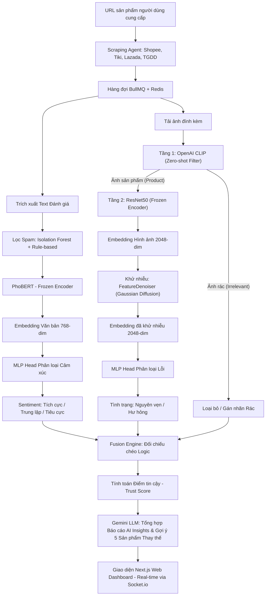

# CHƯƠNG 1: GIỚI THIỆU BÀI TOÁN & PHƯƠNG PHÁP TIẾP CẬN

## 1. Phân Tích Vấn Đề (Problem Definition)

### 1.1 Bối cảnh thực tiễn tại Việt Nam
Thị trường Thương mại Điện tử (TMĐT) Việt Nam đang trải qua thời kỳ bùng nổ mạnh mẽ với sự thống trị của các nền tảng lớn như Shopee, Tiki, Lazada và Thế Giới Di Động (TGDD). Theo các báo cáo thường niên, hàng chục triệu giao dịch được thực hiện mỗi ngày, kéo theo khối lượng khổng lồ các đánh giá (reviews) từ người tiêu dùng. Đánh giá sản phẩm đã trở thành nguồn thông tin tham khảo quan trọng nhất ảnh hưởng trực tiếp đến hành vi và quyết định mua sắm của khách hàng.

Mặc dù khối lượng dữ liệu này chứa đựng giá trị thông tin khổng lồ, người tiêu dùng thực tế tại Việt Nam lại gặp rất nhiều khó khăn trong việc ra quyết định do chất lượng thông tin đánh giá không đồng đều, bị nhiễu loạn nghiêm trọng bởi nhiều yếu tố.

### 1.2 Các thách thức cốt lõi và Thực trạng dữ liệu
Dự án này tập trung giải quyết bốn thách thức lớn đang tồn tại trên các sàn TMĐT tại Việt Nam:

1. **Đánh giá giả mạo (Spam/Seeding Reviews):** 
   Sự xuất hiện dày đặc của các đánh giá do bot hoặc người dùng ảo (ảo/seeding) được thuê để viết nhằm thao túng điểm số sản phẩm (nâng điểm cho shop mình hoặc hạ uy tín shop đối thủ). Các đánh giá này thường có độ trùng lặp cao hoặc mang các đặc trưng hành vi bất thường.
2. **Hình ảnh đính kèm mang tính đối phó (Irrelevant Image Spam):** 
   Các sàn TMĐT tại Việt Nam thường có cơ chế tặng điểm thưởng hoặc xu khi người dùng tải lên hình ảnh kèm đánh giá. Do đó, một lượng lớn người dùng tải lên các hình ảnh hoàn toàn không liên quan (ảnh selfie, ảnh phong cảnh, ảnh screenshot điện thoại, ảnh meme,...) chỉ để đối phó nhận xu. Điều này làm loãng thông tin thẩm định thực tế của sản phẩm.
3. **Hiện tượng nhiễu đặc trưng (Feature Noise) trong học máy:** 
   Các mô hình AI khi sử dụng các mạng trích xuất đặc trưng được huấn luyện sẵn (Pre-trained Models như PhoBERT, ResNet50) thường gặp vấn đề nhiễu đặc trưng do sự lệch pha tác vụ (task mismatch) và nhãn dữ liệu bị gán sai trong thực tế. Nếu không có cơ chế khử nhiễu (Denoising) trước khi đưa vào bộ phân loại, chất lượng dự đoán của mô hình sẽ bị suy giảm đáng kể.
4. **Sự thiếu hụt phân tích đa chiều:** 
   Hệ thống hiển thị của các sàn hiện tại chỉ cung cấp điểm sao trung bình tổng thể, không bóc tách được các khía cạnh cụ thể mà người mua quan tâm như: chất lượng sản phẩm thực tế, dịch vụ chăm sóc khách hàng, tình trạng đóng gói hộp hàng, hay tốc độ vận chuyển.
5. **Thiếu cơ chế gợi ý hỗ trợ quyết định:** 
   Khi người dùng tiếp cận một sản phẩm có rủi ro cao (chứa nhiều đánh giá giả mạo hoặc phản ánh hàng hư hỏng), luồng mua sắm của họ thường bị gián đoạn. Hiện tại chưa có hệ thống nào tự động cảnh báo và gợi ý ngay các sản phẩm tương tự có độ tin cậy cao hơn để hỗ trợ luồng quyết định mua sắm của khách hàng.

### 1.3 Tính cấp thiết và Ý nghĩa thực tiễn
Việc xây dựng một hệ thống tự động thu thập, phân tích đa phương thức (kết hợp cả văn bản tiếng Việt và hình ảnh thực tế), khử nhiễu đặc trưng, và đưa ra cảnh báo thông minh là vô cùng cấp thiết nhằm:
* **Đối với người tiêu dùng:** Bảo vệ người mua khỏi các bẫy mua sắm, tiết kiệm thời gian lọc review rác, hỗ trợ đưa ra quyết định mua hàng thông thái dựa trên điểm tin cậy thực tế (Trust Score).
* **Đối với doanh nghiệp/Nhà bán hàng uy tín:** Tôn vinh các sản phẩm thực chất, hạn chế tác động tiêu cực từ các chiến dịch seeding bôi nhọ của đối thủ cạnh tranh.
* **Đối với nghiên cứu khoa học:** Thu hẹp khoảng cách giữa lý thuyết học máy đa phương thức và nhu cầu thực tiễn của ngôn ngữ tiếng Việt cũng như thói quen tiêu dùng đặc thù tại Việt Nam.

---

## 2. Mục Tiêu của Đồ Án (Project Objectives)

Đồ án hướng tới việc giải quyết triệt để các vấn đề nêu trên thông qua các mục tiêu định lượng và định tính cụ thể:

### 2.1 Các mục tiêu cụ thể
1. **Về Dữ liệu:** 
   Xây dựng luồng thu thập dữ liệu đa nguồn (Shopee, Tiki, Lazada, TGDD) hoạt động tự động và ổn định, có khả năng xử lý bất đồng bộ và trích xuất dữ liệu thô bao gồm văn bản tiếng Việt, số sao đánh giá và hình ảnh thực tế từ các URL sản phẩm.
2. **Về Lọc nhiễu hình ảnh:** 
   Phát triển pipeline xử lý ảnh 2 tầng. Tầng 1 sử dụng mô hình học không giám sát/zero-shot (CLIP) để nhận diện và loại bỏ hoàn toàn các hình ảnh rác không liên quan. Tầng 2 sử dụng mô hình học sâu ResNet50 kết hợp với bộ lọc khử nhiễu đặc trưng để phát hiện tình trạng hư hỏng vật lý của sản phẩm/hộp hàng.
3. **Về Phân tích Văn bản & Cảm xúc:** 
   Phát triển hệ thống phát hiện hành vi seeding/spam (dựa trên thuật toán Isolation Forest kết hợp Rule-based). Huấn luyện và tối ưu hóa mô hình học sâu chuyên biệt cho tiếng Việt (PhoBERT) kết hợp với MLP classification head để phân loại cảm xúc văn bản theo ba nhãn (tích cực, tiêu cực, trung lập).
4. **Về Khớp nối Đa phương thức & Đề xuất:** 
   Xây dựng thuật toán tính toán **Điểm tin cậy (Trust Score)** thông qua việc đối chiếu logic chéo giữa nhánh văn bản và nhánh hình ảnh. Tích hợp Mô hình ngôn ngữ lớn (Gemini LLM) để sinh báo cáo tóm tắt rủi ro và gợi ý top 5 sản phẩm thay thế có Trust Score cao nhất.
5. **Về Triển khai hệ thống:** 
   Xây dựng và đóng gói toàn bộ giải pháp thành một ứng dụng Web hoàn chỉnh hoạt động theo thời gian thực (Real-time Web App) hỗ trợ theo dõi tiến trình xử lý và truy xuất lịch sử phân tích.

### 2.2 Các chỉ số hiệu năng (KPIs)
* **Mô hình Văn bản:** Đạt điểm Macro F1 $\geq 0.75$ trên tác vụ phân loại cảm xúc 3 lớp.
* **Mô hình Hình ảnh:** Đạt độ chính xác (Accuracy) $\geq 85\%$ đối với tác vụ nhận diện hàng hóa hư hỏng/ảnh rác sau khi đã lọc nhiễu đặc trưng.
* **Thời gian đáp ứng (Latency):** Hệ thống tối ưu hóa luồng xử lý bất đồng bộ thông qua hàng đợi giúp giảm thiểu thời gian chờ của người dùng cuối.

### 2.3 Câu hỏi nghiên cứu (Research Questions)
* **RQ1:** Việc áp dụng mô hình ngôn ngữ chuyên biệt cho tiếng Việt (PhoBERT) kết hợp MLP Classifier mang lại sự cải thiện hiệu năng như thế nào so với các mô hình học máy truyền thống trên tập dữ liệu đánh giá bị mất cân bằng lớp?
* **RQ2:** Quy trình khử nhiễu đặc trưng (Feature Denoising) dựa trên khuếch tán Gaussian (Gaussian Diffusion) giúp nâng cao độ chính xác của mô hình phân loại hình ảnh (ResNet50) như thế nào so với việc phân loại trực tiếp từ đặc trưng thô?
* **RQ3:** Việc đối chiếu chéo thông tin đa phương thức (văn bản & hình ảnh) giúp giảm thiểu tỷ lệ nhận diện sai lệch và nâng cao độ chính xác của Điểm tin cậy (Trust Score) ra sao so với việc chỉ phân tích đơn phương thức?

---

## 3. Tổng Quan về Phương Pháp (Methodology Overview)

Hệ thống được thiết kế theo một quy trình khép kín từ khâu thu thập dữ liệu cho đến khâu phân tích thông minh và hiển thị kết quả cho người dùng. Sơ đồ kiến trúc tổng quát của phương pháp tiếp cận được mô tả chi tiết dưới đây.

### 3.1 Quy trình hoạt động chi tiết của các thành phần

#### 3.1.1 Khai thác dữ liệu (Data Scraping & Queueing)
* **Scraper:** Hệ thống sử dụng một tác nhân cào dữ liệu thông minh hỗ trợ các thư viện HTTP client hiệu năng cao đối với Tiki (qua direct API) và Playwright headless đối với Shopee/Lazada để bắt gói tin mạng, tránh bị tường lửa chặn.
* **Hàng đợi tác vụ:** Sử dụng **BullMQ** kết hợp **Redis** để quản lý hàng đợi các job phân tích. Khi người dùng nhập URL, Node.js đẩy job vào hàng đợi và trả về ID ngay lập tức để duy trì kết nối ổn định, tránh nghẽn luồng xử lý chính.

#### 3.1.2 Nhánh phân tích Văn bản (Text Pipeline)
* **Lọc thư rác (Spam Filter):** Kết hợp thuật toán Isolation Forest (học không giám sát phát hiện các bình luận bất thường về mặt thống kê) và các bộ luật (Rule-based) để phát hiện hành vi seeding. Hệ thống tích hợp một danh sách Whitelist cho các câu bình luận ngắn nhưng vô hại để tránh việc trừ điểm oan các đánh giá thật.
* **Phân tích cảm xúc:** Sử dụng kiến trúc pre-trained **PhoBERT (base)** của VinAI được đóng băng encoder (`frozen encoder`) để trích xuất vector đặc trưng 768 chiều biểu diễn ngữ nghĩa tiếng Việt tối ưu. Vector này sau đó được chuyển vào một MLP Classifier mỏng (768 $\to$ 256 $\to$ 128 $\to$ 3) được huấn luyện độc lập để phân loại cảm xúc thành *tích cực, tiêu cực, trung lập*.

#### 3.1.3 Nhánh phân tích Hình ảnh 2 Tầng (2-Stage Vision Pipeline)
Do dữ liệu ảnh đính kèm trên các sàn TMĐT Việt Nam chứa rất nhiều nhiễu rác, nhánh Vision được thiết kế đặc biệt gồm 2 tầng xếp chồng:
* **Tầng 1 - Bộ lọc CLIP (Zero-shot Binary Filter):** 
  Sử dụng mô hình `openai/clip-vit-base-patch32` thực hiện phân loại zero-shot nhằm lọc bỏ ảnh không liên quan. Ảnh được so khớp độ tương đồng với 2 nhóm prompts: nhóm *Product* (ví dụ: "a photo of a product package",...) và nhóm *Irrelevant* (ví dụ: "a selfie of people", "a screenshot of phone app",...). Các ảnh thuộc nhóm Irrelevant sẽ được đánh nhãn ngay là "Không liên quan" và không được truyền tiếp xuống Tầng 2 để tiết kiệm chi phí tính toán và tránh gây nhiễu cho mô hình phân loại lỗi.
* **Tầng 2 - Trích xuất đặc trưng với ResNet50:** 
  Các ảnh được xác định là ảnh sản phẩm thật sẽ đi qua mạng **ResNet50 (frozen encoder)** để trích xuất vector đặc trưng 2048 chiều đại diện cho hình ảnh sản phẩm.
* **Khử nhiễu đặc trưng (Feature Denoising - MDSBR):** 
  Để loại bỏ nhiễu trong không gian vector biểu diễn do lỗi nhãn hoặc nhiễu môi trường chụp ảnh, hệ thống tích hợp module **FeatureDenoiser** phỏng theo kiến trúc **MDSBR (RecSys'25)**. Module này sử dụng quá trình **Khuếch tán Gaussian (Gaussian Diffusion)**. 
  * *Quá trình khuếch tán thuận (Forward Diffusion):* Thêm nhiễu Gaussian vào đặc trưng sạch theo một lịch trình beta cosine/linear qua các bước thời gian $t$.
  * *Quá trình khuếch tán ngược (Reverse Diffusion - Denoising MLP):* Một mạng MLP nhận đặc trưng bị nhiễu kết hợp với embedding bước thời gian (sinusoidal timestep embedding) để học cách khôi phục lại đặc trưng sạch ban đầu.
* **Phân loại lỗi hộp hàng (MLP Defect Classifier):** 
  Đặc trưng sau khi lọc nhiễu qua Denoiser (2048-dim) sẽ được chuyển vào một MLP Head (2048 $\to$ 256 $\to$ 128 $\to$ 2) để phân loại 2 lớp: `defect` (Hộp hàng hư hỏng/móp méo) hoặc `no-defect` (Nguyên vẹn).

#### 3.1.4 Khớp nối Đa phương thức & Tính toán Điểm tin cậy (Multimodal Fusion & Trust Score)
Kết quả từ nhánh văn bản và nhánh hình ảnh được kết hợp thông qua một bộ logic đối chiếu chéo (Cross-Modal Verification):
* **Đồng thuận tích cực:** Văn bản tích cực + Ảnh nguyên vẹn (Intact) $\Rightarrow$ Sản phẩm có độ tin cậy rất cao.
* **Đồng thuận tiêu cực:** Văn bản tiêu cực + Ảnh hộp hàng hư hỏng (Damaged) $\Rightarrow$ Ghi nhận lỗi vật lý thực tế, giảm điểm Trust Score.
* **Mâu thuẫn logic:** Văn bản khen ngợi nhưng ảnh đi kèm lại cho thấy hộp hàng bị bẹp nát $\Rightarrow$ Cảnh báo "Khen ngợi đáng ngờ" (nghi ngờ seeding lộ liễu), trừ điểm Trust Score nặng.
* **Bổ trợ:** Văn bản tiêu cực (chê giao hàng chậm, thiếu phụ kiện) nhưng ảnh nguyên vẹn $\Rightarrow$ Phân loại đúng lỗi dịch vụ thay vì lỗi sản phẩm.
* **Chống nhiễu:** Đánh giá có ảnh không liên quan (Irrelevant) $\Rightarrow$ Loại bỏ trọng số ảnh ra khỏi quá trình chấm điểm, chỉ chấm điểm dựa trên văn bản.

#### 3.1.5 Báo cáo AI Insights và Gợi ý Thông minh
* **Gemini LLM Integration:** Toàn bộ kết quả phân tích cảm xúc khía cạnh, tình trạng lỗi hình ảnh, và các bình luận bất thường được định dạng thành payload gửi tới Gemini API để tạo báo cáo phân tích tổng hợp trực quan (AI Insights) và mức độ rủi ro (Risk Level).
* **Đề xuất thay thế:** Nếu Trust Score của sản phẩm hiện tại thấp dưới ngưỡng an toàn, hệ thống sẽ tự động kích hoạt module gợi ý để tìm kiếm và đề xuất 5 sản phẩm tương tự trên cùng hệ thống có điểm Trust Score cao nhất, đảm bảo luồng trải nghiệm mua sắm của người dùng không bị gián đoạn.

#### 3.1.6 Kiến trúc Triển khai Phần mềm (System Deployment)
* **Frontend:** Next.js (App Router) xây dựng giao diện đẹp mắt, tương tác mượt mà.
* **Backend Orchestrator:** Node.js (Express, Sequelize ORM kết nối cơ sở dữ liệu Supabase PostgreSQL) quản lý API, xác thực người dùng bằng Google OAuth, và phối hợp hàng chờ tác vụ.
* **AI Inferences Server:** FastAPI (Python) quản lý và chạy suy luận cho các mô hình PhoBERT, CLIP, ResNet50, và FeatureDenoiser.
* **Real-time Communication:** **Socket.io** đẩy trực tiếp phần trăm tiến độ xử lý và kết quả phân tích tức thời từ server về trình duyệt của người dùng.

---

### 3.2 Vai trò và Mục đích của các mô hình cơ sở (Baseline Models)

Trong quá trình nghiên cứu và phát triển học máy của đồ án, việc xây dựng và huấn luyện các mô hình cơ sở (Baseline Models) đóng vai trò vô cùng quan trọng nhằm đối chiếu và kiểm nghiệm hiệu năng thực tế của các giải pháp đề xuất. Hệ thống duy trì việc huấn luyện và thử nghiệm hai mô hình cơ sở chính:

1. **Text Baseline Model (Weighted Soft-Voting Ensemble):**
   * **Kiến trúc:** Mô hình sử dụng phương pháp trích xuất đặc trưng TF-IDF (với `max_features=15,000` và cụm từ ghép song song `ngram_range=(1,2)`) kết hợp thuật toán cân bằng lớp SMOTE để cân bằng dữ liệu huấn luyện. Module phân loại là một mô hình Ensemble tích hợp biểu quyết mềm (Soft-Voting) giữa 3 thuật toán học máy truyền thống: Logistic Regression (LR), Calibrated LinearSVC (SVM tuyến tính đã được hiệu chỉnh xác suất), và Random Forest (RF). Trọng số biểu quyết được tối ưu hóa tự động bằng thuật toán xác định độ chính xác trên tập kiểm thử validation.
   * **Mục đích huấn luyện:** 
     * Thiết lập một **mốc hiệu năng nền tảng** về thời gian suy luận và độ chính xác để làm tiêu chuẩn đối sánh trực tiếp với mô hình học sâu PhoBERT (nhằm trả lời câu hỏi nghiên cứu **RQ1**).
     * Cung cấp phương án dự phòng (fallback) cực kỳ nhẹ cho hệ thống. Nhờ độ phức tạp tính toán thấp, mô hình này có khả năng suy luận trực tiếp trên CPU chỉ trong vài mili-giây, giúp tiết kiệm tài nguyên máy chủ.
     * Làm công cụ đối chứng giúp đánh giá xem việc sử dụng mô hình học sâu Transformer phức tạp có thực sự mang lại lợi ích hiệu năng vượt trội so với chi phí tính toán hay không.

2. **Image Baseline Model (MobileNetV3):**
   * **Kiến trúc:** Sử dụng mạng MobileNetV3-Large pre-trained trên ImageNet làm backbone và áp dụng Transfer Learning để tinh chỉnh (fine-tuning) các lớp phân loại trên tập dữ liệu hình ảnh lỗi hộp hàng.
   * **Mục đích huấn luyện:**
     * Thiết lập một baseline thị giác máy tính siêu nhẹ (chỉ khoảng 17MB dung lượng bộ nhớ so với hơn 100MB của ResNet50) và có tốc độ suy luận cực nhanh trên CPU (~150ms so với ~400ms của ResNet50).
     * Cung cấp một nghiên cứu so sánh thực nghiệm chi tiết (về F1-score, Recall, Latency) với mạng ResNet50. MobileNetV3 đại diện cho hướng thiết kế tối ưu hóa tốc độ và tài nguyên phần cứng (Mobile/Embedded-friendly), trong khi ResNet50 đại diện cho hướng ưu tiên dung lượng mô hình lớn để đạt độ chính xác tối đa.
     * Thực hiện các kiểm nghiệm xuất bản mô hình sang định dạng **ONNX** nhằm đánh giá khả năng tăng tốc suy luận trực tiếp trên máy chủ web mà không cần phần cứng GPU chuyên dụng.

